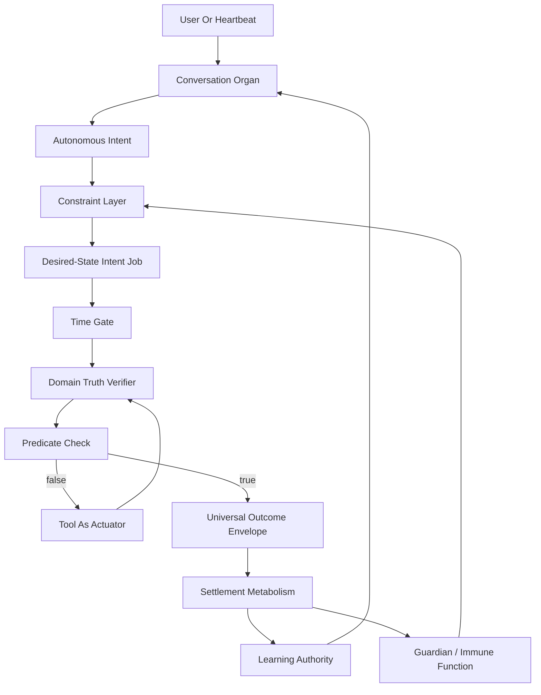

# Rozi X MECCA Official Documentation

## Document Status

**What this document is:** The public architecture story for Rozi X MECCA — for anyone who wants to understand the project without reading the private codebase.

**Living document:** This page is updated as the architecture develops. When new capabilities are implemented and ready to describe publicly, they are reflected here. Treat each refresh as a current snapshot of the public architecture narrative, not a one-time frozen brochure.

**What it is for:** To explain what Rozi X MECCA is aiming to be, what already exists in working form, how the major pieces fit together, and where honest claim boundaries sit. Plain-language capability examples appear in **What Rozi Can Do In Real Life**; deeper architecture sections carry the technical shape.

**How to use it:** Read it as orientation and evidence-backed overview. Later sections carry the substance. Where work is still in progress, this document says so rather than overselling.

**Honest frame:** Rozi X MECCA is a serious local-first cognitive architecture under active construction. It should not be read as finished AGI, a sentient being, a certified safety framework, a guaranteed trading system, a completed autonomous enterprise product, or a proven first-ever scientific discovery.

**Scope note:** This page covers architecture, current capabilities, public evidence, and honest limits. Day-to-day operating runbooks stay private.

**Last public refresh:** 2026-07-14.

---
## Abstract

**In one line:** Rozi is built so “done” means checked against reality — not a tool saying “okay.” That verification law was forged on live trading stakes, then extended to operator workflows.

Most assistants will confidently report completion the moment a tool returns "okay," even when the real world never changed. Rozi X MECCA is built so that kind of false success is illegal by architecture: tools are actuators, not truth. Completion requires domain verification against reality — the difference between an employee who says "I handled it" and one who shows confirmation.

Rozi X MECCA is a local-first cognitive substrate architecture for autonomous assistant organisms. It treats memory, intent, action, verification, settlement, and authority as parts of one outcome-grounded control system instead of separate chatbot features. The core thesis is that an assistant should not claim completion because a tool returned `success: true`, a scheduler fired, or an idempotency layer replayed a cached result. It should claim completion only when the relevant domain truth adapter verifies that the intended predicate is satisfied.

MECCA means **Metabolic Evolutionary Contract Cognition Architecture**. It is the cognitive substrate. Rozi X is the target organism: owner-loyal, portable, local-first, authority-aware, and able to grow from verified experience. Kryptonite is the first large working body of the organism: a real exchange-connected trading workstation with event-driven data, ledger truth, capital controls, AI coordination, and autonomous operating laws.

The newest implemented core is **Universal Predicate-Gated Reconciliation**: every future promise or action intent becomes a desired-state contract. Time is only a gate. Tools are only actuators. Domain truth verifiers decide whether the predicate is true. Universal Outcome Envelopes carry phase truth, evidence, remaining gap, and next action. Settlement converts verified outcomes into credit, confidence, learning, and future authority.

This rule is universal, not tool-specific. A liquidation retry, a Telegram send, a calendar write, a browser action, a workspace mutation, an autonomous trade, and a future organ all use the same shape: desired predicate first, actuator second, verifier before completion, envelope as the machine-readable control packet, settlement after verified terminal truth.

This architecture synthesizes established ideas: cybernetics, control theory, MAPE-K autonomic computing, Belief-Desire-Intention agents, OODA, Kubernetes-style reconciliation, desired-state configuration, runtime verification, proof-carrying code, sagas, event sourcing, proper scoring rules, Reflexion-style verbal reinforcement, skill libraries, and object-capability security. Its novelty is not that those fields were invented here. Its contribution is the unification of those mechanisms into a local-first assistant organism whose claims, memories, skills, and authority are settled against verified outcomes.

The practical framing is simpler: **MECCA is the framework**. The model is a replaceable brain. The workflows — intent contracts, tool actuation under Guardian, domain verification, outcome envelopes, settlement, cognitive blackboard metabolism, and interruptible thought drafts — are what turn a capable language model into a disciplined assistant organism instead of a chat window that hopes the next token is enough.


---

## Why this matters in 2026

False completion — agents asserting "done" when environment state disagrees — is an active research frontier in 2026. Labs publish verifiers, monitors, and behavioral contracts; much of that work still validates in simulation and treats verification as a bolt-on guardrail.

Rozi X's public differentiators:

1. **Integrated organism, not a bolt-on verifier.** Verified-against-reality action is the operating metabolism, not a verification layer bolted onto a chat model.
2. **Live financial proving ground.** The law was forged on an exchange-connected trading workstation where a fake "done" costs real money — then extended to operator workflows (mail, calendar, research, browser under warrant).
3. **Multi-domain continuous operator surface** under one authority membrane, not a single-benchmark demo.
4. **Safety and capability fused.** Verification is native law, not a "verifier tax" bolted on after fluent generation.

For the founder statement and plain-language explainer, see the public About pages on the investor site.

---

## Executive Overview

Rozi X MECCA is best described as:

- **A contract-cognition architecture:** memories, lessons, skills, rules, and actions are treated as testable commitments, not inert stored text.
- **A local-first assistant organism substrate:** cognition, identity, authority, memory, and verification are designed to survive across sessions and machines without requiring centralized cloud custody as the primary source of self.
- **A verified desired-state action model:** language intent becomes a predicate over reality; tools are subordinate mechanisms for closing the gap.
- **A settlement economy for learning:** future confidence and authority are earned from verified outcomes, not granted by prompt text or model confidence.
- **A cognitive immune architecture:** a Guardian/capability membrane, constraints, proof obligations, false-success bans, and settlement quarantine protect the organism from corrupt action and corrupt learning.
- **A metabolic continuity framework:** interrupted thoughts, idle attention proposals, async job results, and organism concern observations are first-class cognitive events on a shared blackboard — think-time continuity under the same verification discipline that governs motor action, with sense≠speak so unchanged state does not spam chat.
- **The parent architecture of Kryptonite:** Kryptonite remains a major limb and training ground, but Rozi X MECCA is larger than trading.

The defensible executive claim is not that Rozi X MECCA invented every component of AI safety or that it constitutes finished AGI. The defensible claim is:

> Rozi X MECCA is a novel synthesis architecture for a local-first autonomous assistant organism, built from real control, verification, learning, and security principles, with working code paths that already enforce verified predicate settlement for scheduled intent and action outcomes — and metabolic continuity for interrupted cognition — under substrate verification rather than model narration alone.

---


## Current System Footprint

These figures are measured from the tracked app repository after excluding local runtime database/export artifacts. They are not marketing projections. They are the current physical footprint of the system Rozi X MECCA is growing from.

| Area | Current Evidence |
| --- | --- |
| Tracked source / text / documentation footprint | Large multi-hundred-thousand-line tracked corpus across source, tests, prompts, and documentation (exact counts drift; treat as order-of-magnitude footprint, not a marketing KPI). |
| Python application code | Hundreds of Python modules under `core/`, `services/`, `ui/`, `workers/`, `infra/`, and related packages. |
| Test surface | **142** Python test files; latest collection snapshot **1145** tests (2026-07-11). Full-suite pass counts move with the branch — do not treat a frozen number as eternal proof. |
| Core trading / execution layer | Substantial `core/` surface: engine, ledger, risk, safety, market data, capital, performance, liquidation, recovery, and portfolio reconciliation paths. |
| Service / cognition layer | Substantial `services/` surface: providers, memory, intent authority, Guardian, reconciliation, outcome envelopes, warrants, reckoning, scheduling, media, browser bridge, image enrichment, Workspace, operator relay, Cursor delegation, cognitive blackboard / attention metabolism, and training-corpus helpers. |
| Operator UI layer | Substantial `ui/` surface: trading, portfolio, ledger, charts, news, tips, brain metrics, panel adapters, and audit windows. |
| Prompt / constitution modules | Dozens of prompt/reference modules covering identity, trading-law, heartbeat, Guardian, research, memory, tool-navigation, browser, Workspace, relay, delegation, and cognitive metabolism. |
| Provider breadth | Dedicated local and hosted AI provider seams exist for `llama_cpp`, LM Studio/OpenAI-compatible transport, OpenAI, OpenRouter, and Perplexity, plus model-family adapters for OpenAI-style, Anthropic, Qwen, and DeepSeek schemas. |

### Neural And Learning Substrate

Rozi X MECCA does not currently claim that a finished proprietary neural model has already been trained and deployed as Rozi's final brain. The more accurate, and more important, claim is that the app already contains a real neural-compatible learning substrate:

- `services/unified_brain_db.py` defines the PostgreSQL unified-brain layer with `experiences`, `feature_cache`, `model_registry`, `strategy_memory`, `decision_log`, `ai_conversations`, `ai_memories`, `symbol_research_memories`, `warrants`, and `action_idempotency` tables.
- The unified brain stores semantic memory surfaces with `pgvector`-style `vector(384)` embeddings for AI memories, symbol research memories, and warrants.
- `ai/learning_runtime.py` records AI learning events with `model_id`, `policy_version`, `data_slice`, outcome metrics, decision context, confidence shift, market regime, rationale, canary flag, and promotion state.
- The learning runtime includes token-bucket rate limiting per `(model_id, policy_version, created_by)` so learning signals cannot spam the nervous system unchecked.
- The model registry tracks model name, type, version, storage path, performance metrics, dependencies, active status, and retraining timestamps.
- `services/rozi_training_corpus.py` converts high-credit warrants into JSONL-ready instruction examples for future MiniCPM-o LoRA/QLoRA work served through the existing `llama_cpp` provider seam.
- `services/reckoning_ledger.py`, `services/reckoner.py`, `services/warrant_hooks.py`, and `services/credit_estimator.py` form the settlement and credit pathway that decides which memories, lessons, actions, and skills deserve future authority.

The strategic significance is not that a neural model exists somewhere in the stack. The stronger point is that the app already contains the operational bones of an outcome-settled learning organism: vector memory, experience capture, model registry, canary/promotion fields, high-credit corpus export, warrant credit, action settlement, and local-model serving seams connected to a real trading/operator body.

---

## Architectural Convergence

Rozi X MECCA did not originate from a single document or model answer. It emerged from internal research passes, code audits, literature-backed review, clean-room subagents, independent analysis, and external comparison. The important result is that the independent runs did not merely agree on tone; they converged on the same missing architecture and named it differently.

| Investigation Arc | Name It Found | Core Unit | What The Unit Carries | Missing Piece It Identified |
| --- | --- | --- | --- | --- |
| Original MECCA R&D | **Contract Cognition** | Contract | claim, prediction, invariants, governance, settlement | Memory, learning, and action were still too separated. |
| Independent architecture review | **Warrant Ledger** | Warrant | claim, provenance, credit bond, proof certificate, owner-auth scope | Trust needed one out-of-band Guardian and one proof/credit ledger. |
| Independent external review | **Reckoning Substrate** | Claim | body, prediction, provenance, calibrated confidence, links, status, reckonings | Memory and learning had to become the same object reconciled against measured outcomes. |
| Second independent research pass | **Outcome-settled memory under governance** | Verified memory / learning record | evidence, credit, authority, rollback path | The remaining build surface centered on genome, settlement/credit, and a proof object. |
| Predicate-gated reconciliation implementation | **Universal Predicate-Gated Reconciliation** | Intent job | domain, resource, predicate, constraints, time gate, authority, verifier, tool affordances, history | Action completion needed domain truth, not tool success. |

The convergence was the discovery:

> **Contract ≈ Warrant ≈ Claim. Settlement ≈ credit bond reconciliation ≈ reckoning.**

Three differently named systems all pointed to the same center:

> **One append-only ledger where memory, learning, and action are the same kind of object. Each object carries a falsifiable claim or prediction, provenance, outcome-anchored confidence, a verification/proof gate, and owner-auth scope. A bounded Guardian checks the object. Settlement against measured outcomes, not model self-judgment, drives future credit and authority.**

That is the heart of MECCA.

### The Systems Venn Diagram

Research framed the field as three overlapping circles: memory systems, learning systems, and alignment/agent-control systems. Each circle was strong in its own way. None sat in the exact center.

```text
        MEMORY SYSTEMS
        MemGPT, Zep/Graphiti, A-MEM,
        HippoRAG, Titans, Mem0
              \                         /
               \                       /
                \                     /
                 \                   /
                  \                 /
                   \               /
                    \             /
                     \           /
                      \         /
                       \       /
                        \     /
                         \   /
                          \ /
                           X
          THE MISSING CENTER:
          grounded-to-outcome,
          provenance-bearing,
          confidence-calibrated,
          reversible knowledge where
          memory == lesson == warranted action
                          / \
                         /   \
                        /     \
                       /       \
                      /         \
        LEARNING SYSTEMS       ALIGNMENT / AGENT SYSTEMS
        Reflexion, ExpeL,      Constitutional AI,
        Voyager, Self-Refine,  Instruction Hierarchy,
        STaR, TextGrad         RLAIF, capability security
```

The white space was not "better memory" by itself, "better learning" by itself, or "stricter safety" by itself. The white space was the center where all three become one governed metabolism.

### What Existing Systems Had

| System Family | What It Already Had | Why It Mattered |
| --- | --- | --- |
| Vector / long-term memory systems | durable recall, embeddings, salience, sometimes graphs or temporal facts | They made assistants remember beyond the prompt window. |
| Reflection / verbal-learning agents | feedback loops, self-critique, retry improvement, episodic lessons | They showed language agents can improve without immediate weight updates. |
| Skill-library agents | reusable behaviors, executable programs, compositional skill recall | They turned experience into reusable action patterns. |
| Desired-state infrastructure | reconciliation, idempotency, actual-vs-desired state loops | They proved systems survive partial failure by observing reality and converging. |
| Runtime verification / proof systems | predicates, policies, proof obligations, monitorable invariants | They gave a language for "do not trust the action unless the property holds." |
| Capability security / Guardian patterns | least authority, unforgeable authority references, separate monitors | They showed why text must never mint power. |
| Proper scoring / calibration | Brier-style prediction scoring, confidence honesty, outcome credit | They gave a way to reward truth instead of charisma. |

### What They Were Missing

The repeated internal finding was that the leaders each had a piece, but not the whole organism:

| Missing Capability | What It Means | Why It Became MECCA-Critical |
| --- | --- | --- |
| **Outcome grounding** | Every memory or lesson carries a falsifiable expectation reconciled against measured reality. | Without this, the system remembers persuasive text instead of proven truth. |
| **Unified memory == learning substrate** | A memory, lesson, skill warrant, and action claim share one object model. | Without this, the assistant learns in one place, remembers in another, and acts through a third disconnected path. |
| **Provenance plus calibrated confidence** | Each unit knows where it came from and how well it has survived reality. | Without this, recall has no earned trust gradient. |
| **Reversibility and quarantine** | False or expired knowledge can be demoted, invalidated, or rolled back. | Without this, poisoned memories linger and keep influencing behavior. |
| **Bounded credit assignment** | Credit is tied to the decision and time horizon that actually produced an outcome. | Without this, the system rewards the wrong belief, tool, or behavior. |
| **Guardian outside the model** | Authority lives in a bounded checker the big model cannot rewrite. | Without this, safety becomes personality text and can be bargained with. |
| **Predicate truth before completion** | Completion requires a domain verifier satisfying the intended predicate. | Without this, tool success, idempotency replay, and scheduler dispatch create false reality. |
| **Local-first portability** | The architecture can run through CPU-friendly memory, pgvector, local providers, and hosted/local model seams. | Without this, the organism depends on someone else's cloud as its body. |

### Existing Project Assets

The same investigations showed that the project already contained several pieces of the eventual MECCA substrate:

- Kryptonite already had a real body: exchange integration, order truth, ledger events, EventBus wiring, risk gates, ARES, UI panels, workers, and autonomous heartbeat pressure.
- The unified brain already had PostgreSQL/pgvector memory, experiences, model registry, decision logs, warrants, and action idempotency.
- The AI layer already had MAIN/HELPER roles, provider seams, local/hosted model routing, Perplexity research transport, OpenAI media paths, and prompt modules.
- The nervous system already recorded decision points and outcome signals.
- The learning runtime already had learning-event storage, rate limiting, canary flags, confidence shifts, and promotion state.
- The Rozi direction already supplied the loyalty/auth specification: owner loyalty, no text-auth, privacy preservation, anti-sycophancy, and local-brain target.
- The repair work supplied the missing motor discipline: Conversation Organ, Autonomous Intent, Learning Authority, Constraint Layer, Universal Outcome Envelope, Settlement, Universal Predicate-Gated Reconciliation, and the first specialized capability organs — Subject Image Enrichment (Organ 10) and Google Workspace Sense (Organ 11).

This matters because the architecture was not discovered in the abstract and then pasted onto the app. It was forced out of a living system that repeatedly exposed the missing control, verification, and authority organs.

### Defensible Technical Claim

Rozi X MECCA is not a copied pattern from prior literature. It is also not a claim that every primitive was invented from nothing.

The stronger claim is:

> **Rozi X MECCA identifies the missing center between memory systems, learning systems, and agent-control systems; validates that center through multiple independent investigations; and implements the first working substrate pieces inside a real app where false success has consequences.**

That is the difference between a paper idea and an organism beginning to form.

---

## Kryptonite As Proof Environment

Kryptonite is not discarded by Rozi X MECCA. It is the reason the architecture became real.

Kryptonite supplied:

- live exchange consequences,
- real wallet and order truth,
- event-driven market data,
- ledger/accounting pressure,
- risk gates,
- recovery flows,
- autonomous heartbeat pressure,
- UI/operator truth,
- failure cases where chat promises were not enough.

The scheduled LTC unblock incident is the key example. A narrow scheduler executed a tool and reported success, but the UI/engine truth still showed LTC stopped. That proved the missing universal law:

```text
Tool success != predicate truth
Idempotency replay != predicate truth
Schedule dispatch != predicate truth
Only domain verification satisfying the desired predicate can produce reconciled
```

This is the bridge from Kryptonite to Rozi X MECCA. Trading forced the architecture to stop trusting text, tool returns, and cached success. It forced the organism to ground itself in verified reality.

---

## Core Thesis

Most assistant systems treat actions procedurally:

```text
user asks -> model selects tool -> tool returns success -> assistant claims completion
```

Rozi X MECCA treats actions metabolically:

```text
perceive -> understand -> form intent -> self-check -> act -> verify -> settle -> learn
```

The difference is not cosmetic. It changes what "done" means.

In the Rozi X MECCA model:

- a request is not a command string;
- a tool call is not the truth;
- a scheduled task is not completion;
- a memory is not a summary;
- a skill is not a macro;
- authority is not model confidence;
- success is not self-reported.

Everything meaningful becomes a contract against future reality.

### Verified Completion

In MECCA, “done” is not a vibe and not a tool return code. Completion is treated as agreement among the active intent, current authority, declared constraints, actuator result, domain verifier, Universal Outcome Envelope, and settlement path.

That is why a confident prompt reminder, a scheduler firing, an idempotent cache hit, or a local state-machine flag is not enough on its own. Those signals can help the organism act; they do not, by themselves, prove that the intended real-world state is true.

```text
current intent + current authority + constraints
-> desired predicate
-> eligible actuator
-> domain verifier
-> Universal Outcome Envelope phase/next_action
-> settlement and learning
```

---

## Definitions

### Rozi X

Rozi X is the target organism. It is the owner-loyal, local-first, authority-aware assistant identity that should eventually move beyond one app body while preserving its governance, learning history, values, and proof obligations.

### MECCA

MECCA is the substrate:

```text
Metabolic Evolutionary Contract Cognition Architecture
```

It defines how the organism stores contracts, settles outcomes, grows skills, assigns credit, guards authority, resists corruption, and preserves a portable self-image.

### Kryptonite

Kryptonite is the first major body and proving ground: an advanced spot-crypto trading workstation with real exchange integration, PyQt6 operator UI, event-driven architecture, ledger truth, AI coordination, Rabbid Hare autonomous mode, and risk/ARES/ledger gates.

### Contract Cognition

Contract cognition is the rule that memories, lessons, actions, policies, skills, and preferences must be represented as commitments with scope, evidence, expected outcome, constraints, settlement rule, and credit.

### Universal Outcome Envelope

The Universal Outcome Envelope is the action-truth packet. It records:

- intent,
- action type,
- module,
- target,
- risk and authority,
- success criteria,
- phase,
- evidence,
- observed state,
- remaining gap,
- next action,
- confidence,
- learning signal.

The envelope is not decoration for the chat response. It is a control contract the executor consumes: `phase`, `remaining_gap`, and `next action` drive whether the organism stops, retries, recovers, escalates, or settles. When envelope fields disagree, substrate logic treats the result as ambiguous until reconciled — confidence in language does not resolve the contradiction.

### Universal Predicate-Gated Reconciliation

Universal Predicate-Gated Reconciliation is the implemented Phase 9 algorithm:

```text
I = <D, R, P, C, T, A, V, M, H>
```

Where:

- `D` is the domain,
- `R` is the resource,
- `P` is the desired-state predicate,
- `C` is constraints,
- `T` is trigger/time window,
- `A` is authority,
- `V` is the verifier,
- `M` is available module/tool affordances,
- `H` is history.

At time `t`:

```text
O_t = V_D(R)
G_t = gap(P, O_t)
eligible_t = T(t) AND C(I, O_t) AND A(I, R)
```

If `P(O_t)` is true, the job may settle as reconciled without action.

If not eligible, it records waiting, blocked, expired, or ambiguous.

If eligible and the predicate is false, the system chooses an action that should reduce the gap, executes it, observes again, and settles only if `P(O_t+1)` is true.

---

## Architecture Overview



The architecture has nine **substrate organs** that form the control loop, plus **capability organs** (limbs) that attach to that loop as the body grows. Trading is the first major limb. Subject Image Enrichment (Organ 10) is the first research-sense capability organ. Google Workspace Sense (Organ 11) is the first authenticated external-API capability organ. Operator Relay (Organ 12) and Cursor Delegation (Organ 13) extend the body into remote communication and controlled build delegation.

**Substrate organs:**

1. Conversation Organ
2. Autonomous Intent
3. Learning Authority
4. Constraint Layer
5. Executor / Tool Actuator Layer
6. Domain Truth and Reconciliation
7. Universal Outcome Envelope
8. Settlement Metabolism
9. Guardian / Cognitive Immune System

**Capability organs (implemented):**

10. Subject Image Enrichment (Research Sense Organ)
11. Google Workspace Sense (DWD Gmail / Drive / Calendar / Sheets / Docs / Slides / Contacts / Directory — gated universal actuator + method discovery)
12. Operator Relay (Telegram text-cycle communication motor)
13. Cursor Delegation (controlled build and research delegation — first specialist harness membrane)

**Cognitive metabolism (substrate extension, not a numbered organ):** continuous shared working memory (cognitive blackboard), async read/research jobs with natural interjection, idle attention proposals, and organism concern awareness (structured self-checks with sense≠speak). This is the think-time twin of settlement metabolism — still under active hardening and not a claim of finished AGI cognition.

---

## Current Rozi X Capability Presentation

Rozi X MECCA is presented here as a working architecture and capability suite. This section describes what Rozi does today, how MECCA gives those capabilities discipline, and where the official claim boundary remains until runtime proof exists.

### Executive View

**Rozi X** is a local-first AI operating organism for the operator's work. She lives in the desktop app, connects to real tools, remembers useful context, manages a live trading body, communicates through desktop chat and Telegram, and grows through specialized capability organs.

**MECCA** is the control substrate underneath her. It binds intent formation, authority checks, tool actuation, domain verification, Universal Outcome Envelopes, settlement, and learning pressure into one operating discipline. The design goal is simple: Rozi may narrate, reason, and act, but she cannot replace verified reality with a confident sentence, a tool return, a scheduled dispatch, or a cached result.

**Kryptonite** is her first major body: an exchange-connected trading workstation with portfolio panels, market data, order ledgers, risk gates, autonomous trading cycles, and the operational failures that forced MECCA's verified-settlement discipline into existence.

### Operating Surfaces

| Surface | What it is |
| --- | --- |
| **Desktop app** | PyQt6 workstation — chat, trading panels, portfolio, charts, Settings, brain metrics. User-facing brand: **Rozi X**. |
| **Telegram** | Remote operator channel sharing the same interactive tool surface as desktop chat. Delivery hardening covers progress during long tool loops, injecting results to the active channel, and cross-channel escalation so a desktop blocking question can reach a configured operator channel when enabled. |
| **AI providers** | Pluggable backends: OpenAI, OpenRouter, Perplexity, LM Studio / OpenAI-compatible transport, local `llama_cpp`. Rozi routes factual lookups and reasoning through the configured provider; local model files are touched only when a local provider is active. |
| **Settings** | Operator-facing toggles for organs, warrants (Workspace write access and browser-motor write access), Telegram notify, Cursor delegation, Google Workspace read/write, and trading parameters — saved through `ConfigManager` and visible to runtime gates in realtime. |

### Current Capability Portfolio

**Trading and portfolio.** Rozi monitors holdings, trading cycles, market data, and portfolio health inside a real exchange-connected workstation. She can run configured autonomous trading cycles and handle liquidation workflows, but trading actions are never treated as mere chat outcomes. They pass through tool gates, engine and ledger truth, risk controls, idempotency, outcome envelopes, and domain verifiers. Exchange acknowledgement is not enough; order lifecycle, portfolio state, ledger state, and active-cycle truth must reconcile before completion may be claimed. When live prices are missing, portfolio totals must say so. Capital sustainability reporting includes an operator-facing `chat_summary` so questions like “why aren’t we buying / do we have usable liquidity?” get the ranked capital truth instead of improvisation. Authorized multi-step missions (for example sell then rebuy) use a substrate trade-plan limb with envelopes — not repeated mid-plan permission prompts. Recent Executions surfaces open submitted sells as well as fills so the operator console matches ledger truth.

**Universal scheduling and promises.** Rozi's future promises are not stored as loose intentions in chat. A promised future action becomes a durable scheduled intent: the desired outcome, the time or event gate, the normal target tool, and the verifier that can prove whether the state became true. Time is only the release condition. The reconciliation kernel owns the work after release: observe the gap, act if needed, verify the predicate, then settle the result. This same contract covers reminders, Telegram sends, Workspace writes, delayed trading retries, browser health checks, and post-restart continuations.

**Restart-aware continuity.** Rozi can restart the application to load new code or recover cleanly after updates, but restart is not a private message payload. The old process may only report that handoff is armed; the relaunched process owns post-boot confirmation after it consumes and settles the restart marker. Any requested after-restart action -- a phrase in chat, an email, a text, a calendar reminder, a purchase, or an inspection -- must be scheduled as the normal target capability before the restart begins. After boot, the same universal reconciliation substrate releases, dispatches, verifies, and settles that work. Startup context is carried as evidence, then surfaced only when relevant.

**Memory, research, and open web.** Rozi can remember, research, inspect public information, and use configured web and browser tools. Durable operator preferences and directives are recorded as Learning Authority objects (pinned, scoped, supersedable) and recalled **when applicable** — never dumped into every turn. Chat acknowledgment alone is not etching; the durable write path must succeed. Organ 10 provides a structured public image-research sense. Perplexity tools provide live factual lookup, cited answers, reasoning, and deep-research model access (`perplexity_search` / `ask` / `reason` / `research`). That is **API-depth research**, not yet a full multi-cycle Research Quest organ with plan → reflect → conflict-check → deliverable settlement. General actuators such as shell, curl, and browser bridges remain first-class; organs add reliable limbs without reducing the organism to a closed menu. Long-document / book ingest into usable cited knowledge (not mere read-back) is a named research agenda item, not a shipped organ.

**Live browser limb (not a second browser):** Rozi can drive the operator’s real desktop browser session through a local bridge — staying logged in without exporting cookies into the organism database and without spawning a separate automation profile. Browser motor actions require an explicit write warrant (operator-visible in Settings) and live automation enablement; page content never grants authority. Read snapshots, constrained click/type/navigation, session-delta observation, post-motor verification hooks, lease/origin policy, and outcome envelopes exist in substrate. Remaining proof gates center on live probe certification for hard pages (uploads, native dialogs, adversarial content) and operator-complete “any page” claims. Speculative always-on browsing is intentionally off by default.

**Continuous cognition (blackboard metabolism + interruptible thought).** Rozi keeps a shared cognitive blackboard of goals, async read/research jobs, and **Thought drafts**. She can continue conversation while work runs and interject naturally when results land. An idle attention loop may propose small read-only background thoughts under config cadence — including organism self-checks and category application-log reads that match the operator Logs surface. Motor/write tools remain refused on the async enqueue path.

**Sense continuously; speak only when necessary.** Background sensing may keep running while chat stays quiet. Observations are fingerprinted on the blackboard; unchanged state does not re-announce itself. When something new warrants speech, MAIN narrates from evidence envelopes — not canned status scripts. Boot and restart follow the same law: structured concern evidence (startup/restart patterns, health flags, pending work, optional log samples as evidence only) may trigger a natural observation; low-signal boots stay quiet.

**Interrupted thoughts do not die.** When the operator hits Stop, or sends a second message while Rozi is still answering (barge-in), the incomplete generation is **sealed as a Thought draft** on the blackboard — a first-class cognitive object with interrupt class, partial text, and session identity. That is not “abort and forget.” Rozi can list open drafts, redirect them (addition / revision / retraction / resume), or settle them. The draft never mints write authority: thinking continuity is not motor permission. Recovery-quality scoring and accept/reject credit metabolism remain active research; the seal → redirect → settle substrate is implemented and operator-visible.

**Google Workspace.** When configured, Rozi can read and write across the owner's scoped Google services through a fixed Workspace delegation setup (Gmail, Drive, Calendar, Sheets, Docs, Slides, Contacts, and Directory when scoped). Dedicated read tools cover everyday Gmail/Drive/Calendar inspection. A **method-discovery** surface lets her browse the live Google discovery catalog (`list_workspace_methods` / `describe_workspace_method`) before calling the generic actuator, so method paths come from the catalog rather than invention. The generic `workspace_call` actuator can reach any method on any configured service, but every mutation still requires the master write warrant, Guardian authorization, idempotency, and live proof before the organism treats the external state as changed. High-risk Directory/admin mutations stay denylisted until intentionally enabled.

**Operator communication.** Rozi can communicate through desktop chat and Telegram, open a reply cycle when an answer is needed, and connect remote replies back to the local conversation. Delivery hardening includes progress signals during long tool loops, injecting results into the active channel/session, and cross-channel escalation so a desktop blocking question can reach a configured operator channel when enabled. Operator Relay stores outbound and inbound text cycles, correlates replies, and settles outcomes through warrants and label-aware scoring. Proactive notifications remain controlled by operator settings; necessary operator escalation is a separate authority path.

**Conversational intelligence and tool narration.** Rozi's visible language is meant to respond to the situation, not recite fixed status lines. Tool narration is grounded in what she is checking, what arguments were used, what the tool returned, and what happened recently. That language may be natural and flavorful, but it does not create authority, prove completion, or replace a verifier. Boot and restart awareness follow the same rule: facts are carried in a read-only context envelope and concern digest; MAIN narrates only when relevance and a new observation fingerprint justify interaction — never from hardcoded greeting scripts.

**Specialist harness membrane (build and delegation).** Rozi does **not** try to run a cloud fleet of twenty frontier models in parallel. The bleeding-edge path is the opposite: **one local organism** that routes hard specialist work into the best available **external agent harnesses** — under MECCA gates — then settles outcomes back into her own memory and authority.

| Harness | Status | Role |
| --- | --- | --- |
| **Cursor Agent (Organ 13)** | Implemented membrane | Ask / plan / build delegation via CLI, worktree-locked builds, never auto-merge, durable intent jobs, DELEGATION_OUTCOME settlement |
| **Claude Code / Anthropic coding agent** | Research + integration target | Specialist coding limb (CLI / IDE-linked agent loop with permissions, MCP, subagents) — same MECCA pattern as Organ 13 when wired |
| **VS Code (and VS Code–compatible IDE surfaces)** | Research + integration target | IDE diagnostics, diffs, selection context, and MCP “ide” bridges so specialist agents operate inside a real editor workspace Rozi can observe and settle |
| **Perplexity / web / shell / browser** | First-class actuators | Research and open-world action without pretending they are a multi-model Computer product |

The architectural claim is **specialist amplification under substrate law**: Rozi remains the owner-loyal control plane; Cursor, Claude Code, and IDE surfaces are limbs. Public status: gated, reviewable, never self-merging; additional harnesses are not live until their membrane and proof exist.

**Self-maintenance.** Rozi can restart herself, recover scheduled work after restart, avoid launching under the wrong Python environment, and notice meaningful startup or restart patterns as one class of organism concern among others (health flags, pending work, structured self-checks). Settings changes flow through the unified configuration manager, so gates and tools see runtime toggles without requiring a reboot for every switch. Low-signal starts are recorded quietly; meaningful starts and restarts can become natural MAIN-narrated observations when the evidence fingerprint is new.

### Why This Is Different — First-Party Architecture

Rozi is designed to prove work, not just narrate work. The difference is not one feature, one model, or one prompt. It is a **first-party control architecture** — metabolic workflows owned end-to-end by the organism — that can wrap any capable AI provider and force it to behave like a disciplined body instead of a disposable chat turn.

Most consumer and “agent” products are assembled as: model + tool plugins + unverified success. Interrupt them mid-thought and the thought dies. Let a tool return `ok` and the model often claims victory. Swap the model and you still have the same brittle loop. Memory is a bag of embeddings. Safety is a system prompt. Trading, if present, is a bolted script. Remote chat is a second bot with a thinner tool surface. That stack can look impressive in demos; it does not survive false success, restart, or owner loyalty under pressure.

Rozi X MECCA is built the other way around. **The brain is swappable. The metabolism is first-class and first-party.** OpenAI, OpenRouter, Perplexity, LM Studio, or local `llama_cpp` can drive language; MECCA still owns intent contracts, Guardian gates, verifiers, envelopes, settlement, blackboard continuity, Thought-draft finalization, capital/ledger truth, and warrant-gated motors. That is what keeps a capable model subordinate to substrate law — and why copying the chat UI does not copy the organism.

| What commodity stacks optimize | What Rozi X MECCA owns instead |
| --- | --- |
| Fluent next-token answers | Claims that must reconcile against domain truth before “done” |
| Tool plugins as the product | Tools as actuators under Guardian, warrants, idempotency, and envelopes |
| Dump-all memory into the prompt | Applicable recall with Learning Authority (preference ≠ directive ≠ safety never) |
| Abort = discard thought | Interrupted cognition sealed as Thought drafts that can continue |
| Separate bots per channel | One organism across desktop and Telegram with shared interactive surface |
| Second automation browser / cookie vault | Operator’s live browser under explicit motor warrant — content never authorizes action |
| Prompt “remember this forever” | Durable operator-memory write path; verbal etch without it is a lie |
| Parallel mega-model Computer theater | One local control plane + specialist harness membrane (Cursor live; peers gated) |

This is not a claim that no other lab studies control theory, memory, or agents. It is a claim that **few shipping assistants unify those pieces into one local-first organism with a live exchange-connected body and an honest “done means verified” law.** That unification is the architectural edge: harder to bolt on after the fact, and more valuable than another thin layer around the same frontier API.

| Upgrade | What it gives Rozi |
| --- | --- |
| **Universal Predicate-Gated Reconciliation** | Language intent becomes a desired-state contract; time is only a gate; tools are actuators; domain verifiers decide truth; envelopes carry phase, gap, and next action; settlement updates credit and future authority. |
| **Non-substitution enforcement** | The tool loop consumes envelope control fields; ambient memory or helper context cannot authorize writes; exchange/API ack is not completion; internal state-machine success is not external truth without a verifier. |
| **Interruptible Thought drafts** | Stop or barge-in seals incomplete generation as a first-class draft; redirect / settle tools keep cognition alive across interruption — without minting motor authority from the draft. |
| **Contextual interaction layer** | Progress narration and boot greetings are grounded in tool arguments, result payloads, recent status history, scheduled-task evidence, startup/restart facts, and relevance scoring. They are allowed to be flavorful, but they do not mint authority, claim completion, or replace domain verification. |
| **Organs 10–13** | Repeatable, gated, auditable limbs for image research, Workspace DWD, operator relay, and Cursor delegation — without capping general web/shell actuators. |
| **Specialist harness membrane** | Amplify capability by delegating into Cursor (live), and toward Claude Code / VS Code IDE bridges — not by hosting a twenty-model cloud Computer. Program/substrate owns control flow; specialists amplify. |
| **Cognitive blackboard metabolism** | Shared goals, async read/research jobs, natural interjection, idle attention proposals — think-time continuity under motor refuse gates. |
| **Durable operator memory + applicable recall** | Preferences and directives persist as authority-tagged claims with fine scopes; recall surfaces when the turn matches — no dump-all. |
| **Mission trading limb** | Authorized multi-step trade plans execute under envelopes without mid-mission permission theater. |
| **Orchestration substrate (dormant)** | Durable multi-step workflow job store, gates, progress monitor, and audit trail exist; `orchestration.enabled` defaults **OFF** — no live multi-step orchestration worker is claimed. |
| **Outcome-settled learning path** | Warrants, reckoning, vector memory, model registry, and training-corpus export connect verified outcomes to future confidence — not prompt self-judgment. |

#### Interrupted thought — what operators see

In ordinary chat products, Stop usually means: kill the stream, keep some partial text, start over. In Rozi, Stop or a mid-answer second message is a **metabolism event**:

1. Cooperative cancel stops the in-flight generation / tool loop.
2. The incomplete thought is sealed onto the cognitive blackboard as a Thought draft (with interrupt class such as stop or barge-in).
3. Conversation continues; Rozi can pick the draft back up, redirect it when the operator adds, revises, or retracts the goal, or settle it when the thread is done.
4. Tool rounds and async jobs keep running under the same motor refuse / Guardian rules as always.

That is Metabolic Continuity Architecture built **on** MECCA: cognition is a stream of Cognitive Events, not a single disposable completion. The operator-visible win is simple — she can get cut off and still finish the thought like a person who was interrupted, not like a process that crashed.

### What Rozi Can Do In Real Life

These examples are written for anyone evaluating the system — not only engineers. They describe **kinds of work the organism is built to do**, with honest limits. They are not performance guarantees and not a claim that every scenario is already probe-certified in every environment.

#### 1. “Why aren’t we buying? Do we have usable liquidity?”

An operator asks in plain English. Rozi is expected to consult capital sustainability truth — liquid cash, reserves, trapped/dust value, runway — and answer from that report’s operator summary, not from vibes. If the account cannot safely open new exposure, she says so with the ranked reason. That is portfolio honesty as a product feature.

#### 2. Style preferences and standing directives

Style and directive teachings are meant to **stick** as durable operator memory when recorded through the Learning Authority path — then surface when relevant (for example, short closers that end a chat cleanly, or address preferences that shape wording). They are not meant to be pasted into every message. Saying “remember forever” in chat without a durable write is not enough; the architecture treats that gap as a bug class, not a personality quirk.

#### 3. Coins stuck underwater

When positions are underwater but a known recovery technique applies, Rozi’s trading body is designed to **use the recovery policy** under ARES and risk gates — not freeze forever and not average down without limit. The operator can ask about recovery state; the system exposes hold inventory and tier intent. Live long-run proof remains an acceptance gate; the policy is not a profit promise.

#### 4. Sell, then rebuy — one authorized mission

When the operator authorizes a concrete multi-step trade plan, the organism should execute the mission through a substrate trade-plan limb with envelopes — not stall mid-plan asking “should I continue?” after every fill. Mid-mission theater is treated as a failure mode the architecture is actively removing.

#### 5. “Check my email / put this on the calendar”

With Workspace configured, Rozi can read mail, Drive, and Calendar, and can reach other scoped Google services (Sheets, Docs, and similar) through the gated universal actuator. When she does not already know the exact API method path, she is expected to **browse the discovery catalog** first, then act — not invent method names. Writes are possible but **gated**: master write warrant, Guardian, idempotency, and live proof. She should not claim “it’s on the calendar” because a tool returned OK unless the domain proof supports that claim.

#### 6. Use the browser you’re already logged into

Rozi can work through the operator’s real desktop browser session via a local bridge — useful for sites that already hold the operator’s login — without copying cookies into the organism database and without spinning up a second automation profile. Motor actions require an explicit write warrant. Page text never becomes permission. Hard pages still need live probe before “any page” claims.

#### 7. Text her on Telegram while the desktop is busy

Remote chat shares the interactive tool surface. Long tool loops can show progress; answers can inject to the active session; a blocking question on desktop can escalate to Telegram when configured. The architectural point: one organism, two doors — not two disconnected bots.

#### 8. Hit Stop mid-answer; continue later

Stop or a barge-in does not throw the thought away. The incomplete answer becomes a Thought draft Rozi can resume, revise, or settle. Thinking continuity is not trading permission.

#### 9. “Restart and then send me a reminder”

Restart is a controlled handoff. After-boot work must be scheduled as a normal capability before the old process dies; after relaunch, reconciliation releases, verifies, and settles it. Boot chatter is quiet when nothing new happened.

#### 10. “Have Cursor build this”

Hard engineering work can be delegated through the Cursor membrane under gates: worktree-locked builds, never auto-merge, durable intent, outcome settlement. Rozi remains the control plane; the specialist harness is a limb.

#### 11. Research before acting

For factual claims about the world, Rozi is expected to use live research tools rather than invent. Deep research model access exists; a full multi-cycle Research Quest organ (plan → reflect → deliverable settlement) is still on the agenda.

#### 12. Notice when something’s actually wrong at boot

After rapid restarts or odd health signals, Rozi can form a structured concern digest and speak in her own voice when the fingerprint is new — without canned “Everything okay?” scripts and without narrating every quiet boot.

**Takeaway from the examples:** the value is not that each vignette is unique in isolation. Many products can send Telegram, call an LLM, or place an order. The value is that **the same first-party substrate** is supposed to govern all of them: authority, verification, settlement, and continuity — with a trading body that makes false completion expensive.

### Claim Boundaries

Rozi X MECCA is under active construction. Public description separates policy, implemented substrate, runtime proof, and remaining proof gates:

- Rozi is not AGI, sentient, provably safe, a certified safety framework, a guaranteed trading system, a completed autonomous enterprise product, or proven first-ever science.
- Google Workspace writes are a gated universal actuator surface (not ambient permission). Method discovery browses the catalog but does not authorize mutation. A specific Gmail, Calendar, Drive, Sheets, or other scoped mutation is only complete when the tool result and live domain proof support that specific claim.
- Full autonomous multi-step orchestration is not live. The workflow substrate is present and `orchestration.enabled` defaults OFF; post-restart scheduled-task dispatch is real, but it is not the same as a shipped orchestration worker.
- Rozi is **not** a Perplexity Computer clone and does **not** run twenty simultaneous frontier models. Parallelism comes from async jobs, specialist harnesses, and event-driven metabolism — under resource honesty.
- Claude Code and VS Code IDE membranes are **integration targets**, not shipped organs, until code and live proof exist. Organ 13 Cursor is the live reference pattern.
- Cognitive blackboard, attention, interjection, **Thought-draft seal / redirect / settle**, and **organism concern metabolism** (structured self-awareness digest, application-log read tools aligned with the operator Logs surface, sense≠speak fingerprints, MAIN-narrated boot/restart speak without canned scripts) are implemented substrate. Recovery-quality scoring, accept/reject credit for interrupted thoughts, and book-knowledge ingest remain research agenda — not finished product claims.
- `perplexity_research` uses a deep-research model path; it is not yet a full Research Quest organ with multi-cycle plan/reflect/deliverable settlement.
- General web actuators are first-class. A local live-browser bridge substrate exists (health, Settings warrant visibility, constrained read/motor tools, session-delta observation, post-motor verification hooks, warrants, outcome envelopes, audit). It is not presented as “handles any page” or fully operator-complete until a live probe matrix passes for hard pages. Page content never authorizes motor action. A second automation browser profile and cookie vaulting into the organism database are out of design scope.
- Durable operator preference/directive memory has an implemented record/recall path with applicable recall. Chat acknowledgment (“got it etched”) is still not durable authority unless the durable write succeeds. Operator memories are recalled when relevant — not dumped into every turn.
- Telegram shares the interactive tool surface with desktop chat. Progress during long tools, inject-to-active-session, and cross-channel escalation are implemented substrate; phone and desktop are not claimed identical in every edge case until those paths are operator-probed on device.
- Multi-step trading missions (sell→rebuy in one authorized turn) use a substrate mission tool with envelopes rather than narration alone. Long-run money-path acceptance remains required before finished autonomous-trader claims.
- Restart is a proof-carrying capability with marker settlement, detached relaunch, and scheduled-work resumption hooks. It is not a promise that every runtime restart completes cleanly under every failure mode.
- Natural or observant chat language is a presentation layer over grounded context. Fluency does not replace authority, evidence, verification, or settlement.
- Thought drafts are continuity objects, not write warrants. An interrupted thought does not authorize trading, Workspace mutation, or other motor action by itself.

The honest public claim is narrower and stronger: Rozi is a real local-first assistant organism with a **code-backed** control architecture, a live trading body, operator surfaces, growing capability organs, a specialist-harness membrane, continuous cognition with interruptible Thought drafts, durable operator memory under applicable recall, and a discipline that **done means verified against reality** — not narrated — with **remaining proof gates** still open.

---

## Organ 1: Conversation Organ

The Conversation Organ forms live situational understanding. It does not authorize action. It reads the current conversational state, recent context, live evidence, known constraints, learning signals, user correction signals, and the current mode.

Implemented surface:

- `services/conversation_organ.py`
- `AutonomousIntentCandidate`
- active-intent conversion for tool execution
- return-path metadata
- heartbeat/conversation distinction through coordinator context

Its purpose is not to be clever in isolation. Its purpose is to form the candidate that later organs can reject, execute, verify, settle, or learn from.

---

## Organ 2: Autonomous Intent

Autonomous Intent is the structured object that converts situational understanding into a proposed action path with evidence, scope, risk summary, expected outcome, idempotency key, and stop conditions.

It is not a permission ticket.

The correct rule:

```text
Intent proposes.
Constraint Layer invalidates.
Executor acts.
Verifier proves.
Settlement learns.
```

Implemented surface:

- `services/intent_authority.py`
- Entry 10-shaped intent fields
- `AuthorityLevel`
- `MemoryAuthority`
- constraint evaluation
- tool-risk classification

---

## Organ 3: Learning Authority

Learning Authority separates different kinds of remembered information. A discussion signal is not a directive. A user preference is not a safety invariant. An architecture invariant is not a casual observation.

The authority lattice includes:

- `DISCUSSION_SIGNAL`
- `USER_PREFERENCE`
- `USER_DIRECTIVE`
- `ARCHITECTURE_INVARIANT`
- `SAFETY_NEVER`

Learning Authority exists because a growing organism must know which memories can influence which actions.

**Applicable recall:** durable operator preferences and directives are stored as substrate objects with explicit authority — not as chat narration that “remembered forever.” Verbal acknowledgment alone is not Learning Authority. Recall is **applicable**: style and directive memories surface when the turn matches, instead of filling every conversation. Preferences bias wording and choices; directives bias autonomous judgment and strategy; neither overrides live evidence or bypasses Guardian, warrants, or domain verification.

**Status:** durable operator-memory write/recall packaging is implemented substrate (`record_operator_memory` / claim objects with authority, fine scope, supersession, applicable recall). Verbal acknowledgment alone still does not etch. Fine scopes let sibling preferences coexist.

---

## Organ 4: Constraint Layer

The Constraint Layer invalidates bad intent. It does not grant permission.

It checks:

- stale context,
- missing direct command evidence for normal-mode writes,
- missing live evidence for heartbeat writes,
- forbidden action markers,
- safety-never violations,
- idempotency/verification path requirements,
- tool risk class.

This is one of the most important philosophical corrections in the architecture. Rozi is not a chatbot asking for permission slips. Rozi forms intent, then must survive self-check and proof obligations.

---

## Organ 5: Executor / Tool Actuator Layer

The Executor is motor-only. It does not interpret conversation. It receives valid intent and performs the smallest correct action path.

In design, the Executor:

- reads first when needed,
- reconciles before writes,
- uses granular tools,
- obeys idempotency,
- returns verified envelopes,
- stops when terminal truth is reached,
- does not invent its own mission,
- does not expand scope beyond intent,
- does not treat tool return text as final truth,
- does not bypass Guardian or domain truth.

---

## Organ 6: Domain Truth And Reconciliation

Domain Truth is the line between an assistant that talks and an organism that knows whether reality changed.

Implemented surface:

- `services/domain_truth.py`
- `DesiredPredicate`
- `TruthObservation`
- `VerificationResult`
- verifier registry
- generic verifier
- trading symbol-state verifier
- config key verifier

Domain truth answers:

```text
What is the actual state?
Does the actual state satisfy the desired predicate?
What gap remains?
What evidence supports that answer?
```

Universal reconciliation is implemented in:

- `services/intent_jobs.py`
- `services/reconciliation_kernel.py`
- repaired `services/scheduled_actions.py`

The scheduled-action repair is the canonical example. `schedule_task` still exists as an assistant-facing tool, but internally it creates a durable desired-state job. Due work is delegated to the reconciliation kernel. The kernel observes truth, executes only if a gap exists, verifies again, and settles only if the predicate is true.

---

## Organ 7: Universal Outcome Envelope

The Universal Outcome Envelope is the shared language of action truth.

Phases:

```text
intended
attempted
accepted
externally_confirmed
user_confirmed
reconciled
failed
ambiguous
blocked
```

Phase meanings:

- `accepted`: the immediate system accepted or attempted the request.
- `externally_confirmed`: outside evidence confirms the action effect.
- `user_confirmed`: the user confirmed an outcome automation could not fully prove.
- `reconciled`: intended outcome, internal state, and external/domain evidence agree.
- `failed`: the action did not complete.
- `ambiguous`: evidence is partial, contradictory, or insufficient.
- `blocked`: verification or action cannot proceed until a dependency resolves.

Implemented surface:

- `services/outcome_envelope.py`
- central action-tool envelope attachment in `services/tool_registry.py`
- settlement consumption in `services/warrant_hooks.py`
- credit updates in `services/reckoner.py`

Recent hardening:

```text
already_satisfied -> ambiguous unless truth_verification.satisfied
duplicate_call_suppressed -> ambiguous unless truth_verification.satisfied
```

This directly prevents the false-success class found in the scheduled LTC unblock test.

---

## Organ 8: Settlement Metabolism

Settlement is how the organism learns from reality.

Before meaningful action, Rozi records a prediction/warrant:

```text
If this action is taken under this intent and evidence, this outcome is expected.
```

After action, Rozi records observed outcome:

```text
What actually happened?
Was the predicate satisfied?
Was the envelope reconciled, failed, blocked, or ambiguous?
What credit or confidence should change?
```

Implemented surface:

- `services/warrant_hooks.py`
- `services/reckoner.py`
- `services/reckoning_ledger.py`
- `services/credit_estimator.py`

The current scoring foundation includes Brier-style prediction error and confidence/credit updates. This is intentionally conservative. More complex credit markets, Thompson sampling, Bayesian truth serum, CVaR, or Shapley-style attribution may come later, but the safe core is verified-outcome settlement.

---

## Organ 9: Guardian / Cognitive Immune System

Guardian is the boundary between cognition and dangerous authority.

It must be:

- separate,
- fail-closed,
- non-self-modifiable by ordinary model output,
- capability-aware,
- auditable,
- loyal to owner constraints,
- hostile to false authorization-by-text.

Implemented surface:

- `services/guardian.py`
- tool-risk classification and context checks in `services/intent_authority.py`
- generic method restrictions in autonomous contexts
- `USER_BLOCKED` proof requirements

The Guardian is not a fear cage. It is immune function. It allows growth by making corruption harder to absorb as learning.

---

## Organ 10: Subject Image Enrichment (Research Sense Organ)

Subject Image Enrichment is the first specialized **capability organ** beyond the nine-substrate control loop. It is not a people-database broker, CRM enricher, or identity oracle. It is a read-only public-web research sense: discover candidate photos of a named subject, verify them against context, and return honest structured outcomes.

Hard rules:

1. **No guessing.** A single plausible image is not enough unless evidence clears the configured winner threshold.
2. **No hidden gallery leak.** `ambiguous` first-pass results carry count, reasons, and `offer_id` only — not image URLs. Gallery release requires a separate user-confirmed reveal step.
3. **No autonomous enrichment.** Tools are visible on MAIN's normal surface but execution-denied in `autonomous_heartbeat` and `rabbid_hare_autonomous`.
4. **Organ 10 product contract only (not an app-wide ban).** This organ does not broker Clearbit/Apollo/Hunter or credentialed social scraping. Rozi X still has general web actuators (shell/curl, browser bridge, Perplexity) for everything else — see **General actuators and the open web** below.
5. **Structured data, not teleprompter text.** Service and tool payloads carry machine-readable state; Rozi generates user-facing language at response time.

Outcome contract:

| Outcome | Meaning |
| --- | --- |
| `found` | Clear winner — one verified `image_url` + `source_url` + confidence + extraction evidence |
| `ambiguous` | Viable candidates exist but no safe pick — escrowed gallery behind `offer_id` |
| `not_found` | No usable public photos — honest failure, not a guess |

Implemented surface:

- `services/image_enrichment.py` — orchestrator, budgets, caches, ambiguity escrow, scoring
- `services/knowledge_graph_client.py` — entity match on Google Knowledge Graph Search API
- `services/google_vision_client.py` — Cloud Vision verification (fail-closed when disabled or uncredentialed)
- `services/tool_registry.py` — `find_subject_image`, `reveal_ambiguous_gallery` in `memory_market`; outcome module mapping; **not** in `_OUTCOME_ENVELOPE_ACTION_TOOLS`
- `services/reckoning_ledger.py` — read-only `ENRICHMENT` warrants on verified finds
- `infra/config_manager.py` — `image_enrichment.*` behavior defaults (secrets in keyring only)
- `ui/panels/settings_panel.py` — Image Enrichment APIs settings group (`brave_api_key`, `google_kg_api_key`, `google_service_account_path`)
- `config/prompt_modules/ref_image_enrichment.txt` — Organ 10 discoverability (required; registry alone is insufficient)
- canonical implementation spec maintained in private project documentation

**Build pattern:** Organ 10 is the reference template for research-sense capability organs. New organs are delivered through private build procedures before any live claim is made.

Provider footprint:

The exact cloud project, service-account details, key paths, and operator setup are maintained in private operator documentation. The public architecture claim is limited to the mechanism: separated credentials, Settings/keyring storage, configured providers, and live probes before operational claims.

- **Brave Search API** — public-web image and page discovery
- **Knowledge Graph Search API** — entity-name match and official entity image when query is entity-like
- **Cloud Vision API** — face, label, landmark, logo, and safe-search signals for verification

Organ wiring:

```text
User intent -> Constraint Layer -> find_subject_image (Executor)
  -> discovery (Brave) + entity match (KG) + verification (Vision)
  -> EnrichmentResult (found | ambiguous | not_found)
  -> ENRICHMENT warrant (Settlement, read-only auth_scope)
  -> Rozi speaks from structured envelope, not canned script text
```

Verification evidence:

- `tests/test_image_enrichment.py` — **22 passed** (found, ambiguous-redacted, reveal-confirmed, not-found, blocked domains, download bounds, budget/TTL, warrant scope, registry authority, settings keyring)
- registry regression on tool authority and outcome envelopes unchanged

---

## Organ 11: Google Workspace Sense (Track B)

Google Workspace Sense is the second specialized **capability organ**. It accesses the owner's Google Workspace via **Domain-Wide Delegation (DWD)** — impersonating a fixed Workspace user configured in Settings, never from LLM tool arguments. Everyday read tools cover Gmail, Drive, and Calendar. A **universal actuator** (`workspace_call`) reaches any method on any scoped service the credential already authorizes (including Sheets, Docs, Slides, Contacts, and Directory when scoped). A **method-discovery** pair (`list_workspace_methods` / `describe_workspace_method`) walks the live Google discovery document so Rozi can browse exact dotted paths and parameters — the Workspace analogue of trading's `list_trading_engine_methods` — before actuating.

Hard rules:

1. **Separate from Organ 10.** Public image verification and private Workspace access use separate credential tracks. Different service accounts, keyring keys, scopes, and tool groups prevent cross-contamination.
2. **Substrate enforcement, not prompt-only.** `google_workspace_gates.py` blocks unsupervised heartbeat contexts, missing credentials, disabled organ, and private-content reads without warrant.
3. **Impersonation is fixed.** `get_impersonate_user()` reads config/keyring only — tools cannot pass a different mailbox.
4. **Metadata vs private content.** Headers and file listings are Phase 1 defaults. `gmail_read_message_body` and `drive_export_file` require `google_workspace.private_content_warrant`.
5. **No unsupervised heartbeat Workspace tools.** Interactive chat may use the organ; background heartbeat runs are denied for catalog and read surfaces (the gated actuator remains subject to the same organ enablement and write gates).
6. **Structured outcomes.** Every tool returns the universal Workspace envelope via `google_workspace_outcome.py` and `_workspace_tool_dispatch`.
7. **Discovery is not actuation.** Listing or describing a method never mutates Google state and never authorizes a write.

Outcome contract:

| Field | Meaning |
| --- | --- |
| `ok: true` | API call succeeded; payload in `data` |
| `ok: false` + `gws_not_configured` | Missing key path or impersonate user |
| `ok: false` + `gws_libs_missing` | Python deps not installed |
| `ok: false` + `gws_unauthorized` / probe `unauthorized_client` | Admin DWD not authorized for this SA Client ID |
| `ok: false` + `gws_api_not_enabled` | Required cloud API not enabled in the configured private project |
| `blocked` + warrant codes | Private content tool without Settings warrant |

Implemented surface:

| Layer | Path / symbol |
| --- | --- |
| Auth factory | `services/google_workspace_auth.py` — service registry, DWD credentials, lazy builders |
| Errors | `services/google_workspace_errors.py` — HttpError → actionable codes |
| Gates | `services/google_workspace_gates.py` — `gate_workspace_tool` |
| Outcomes | `services/google_workspace_outcome.py` — `workspace_result`, envelope attach |
| Audit | `services/google_workspace_audit.py` — append-only Workspace audit log |
| Discovery | `services/google_workspace_discovery.py` — discovery-document catalog walk |
| Actuator | `services/google_workspace_actuator.py` — gated universal `workspace_call` |
| Gmail | `services/google_workspace_gmail.py` |
| Drive | `services/google_workspace_drive.py` |
| Calendar | `services/google_workspace_calendar.py` |
| Health | `services/google_workspace_health.py` — credential probe (Settings test) |
| Tools | `services/tool_registry.py` — `google_workspace` TOOL_GROUP (11 tools, including discovery + gated `workspace_call`) |
| Config | `infra/config_manager.py` — `google_workspace.*` defaults |
| Settings | `ui/panels/settings_panel.py` — DWD group + Test Connection |
| Prompts | `config/prompt_modules/ref_google_workspace.txt`, `tool_navigation.txt`, `main_ai_identity.txt` |
| Operator + pitfalls | Maintained in private operator documentation; public documentation states architecture and proof boundaries only |
| Bootstrap | Controlled internal bootstrap scripts (key + config + probe; never leave empty key files) |

Tools (read surface + discovery + gated generic actuator):

| Tool | Purpose |
| --- | --- |
| `workspace_health_check` | Operational gate when organ enabled |
| `list_workspace_methods` | Browse supported services or discovery method catalog (optional query filter) |
| `describe_workspace_method` | Parameter / HTTP-verb detail for one dotted method path |
| `gmail_search_messages` | Search inbox; returns ids for metadata/body tools |
| `gmail_get_message_metadata` | Headers without body |
| `gmail_read_message_body` | Full body — **requires private content warrant** |
| `drive_list_files` | List Drive files |
| `drive_get_file_metadata` | File metadata |
| `drive_export_file` | Export Doc/Sheet content — **requires warrant** |
| `calendar_list_events` | Upcoming events |
| `workspace_call` | Generic actuator for any scoped Google service method; writes require master write warrant, Guardian authorization, idempotency, and live proof before completion is claimed |

Operational footprint:

The exact Workspace project, account, service-account, client identifier, key location, API enablement set, and scope list are maintained in private operator documentation. The public architecture claim is limited to the mechanism: fixed configured impersonation, separated credentials, keyring-backed configuration, least-necessary scopes, audit logging, and a live probe before access is claimed operational.

Organ wiring:

```text
User intent -> gate_workspace_tool -> _workspace_tool_dispatch
  -> (discovery) list/describe from discovery document  OR
  -> (actuator) build service + resolve dotted method + execute_google_api
  -> workspace_result envelope + audit
  -> Reads settle from returned data; writes require explicit tool result plus domain proof
```

Verification evidence:

- Focused Workspace / actuator / discovery unit suites under the project virtualenv (mocked externals)
- Live discovery smoke when DWD is configured: service catalog + method describe for known paths
- Live credential probe (`workspace_probe_credentials_impl`) — Gmail list against impersonated inbox when DWD + APIs + key are correct

Write boundary: Gmail send, Calendar create, Drive mutations, Sheets/Docs writes, and other Workspace methods flow through `workspace_call`; availability does not prove mutation. Discovery tools never write. Each mutation still needs the master write warrant / Guardian gates and live proof for the specific mutation before Rozi may claim completion.

**Build pattern:** Organ 11 is the reference template for authenticated external-API capability organs (DWD/auth factory + dedicated TOOL_GROUP + health probe + discovery + universal actuator). Delivery follows private build procedures before operational claims are made.

---

## Capability Organ Delivery Model

Capability organs are settled, gated, auditable limbs for repeatable workflows. They are not the boundary of Rozi's general intelligence, web access, code access, or research access. Rozi can still use general actuators for one-off work; an organ exists when a workflow needs repeatable structure, credentials, substrate gates, outcome envelopes, tests, operator surfaces, and live proof.

A new organ is not considered live because code landed or a tool returned success. It is live only when implementation, operator setup, runtime gates, and domain proof agree. Organs are released through a controlled process; completion requires verified reality rather than narration.

---

## The Algorithm: Universal Predicate-Gated Reconciliation

The algorithm can be written as:

```text
Input:
  intent I = <D, R, P, C, T, A, V, M, H>

Observe:
  O_t = V_D(R)

Compare:
  satisfied = P(O_t)
  gap = G(P, O_t)

Gate:
  eligible = T(t) AND C(I, O_t) AND A(I, R)

If satisfied:
  emit reconciled envelope
  settle

If not eligible:
  emit waiting/blocked/expired/ambiguous envelope
  do not execute

If eligible and not satisfied:
  choose action a from M_D that should reduce gap
  execute a under Guardian, idempotency, and tool context
  observe O_t+1 = V_D(R)
  if P(O_t+1):
      emit reconciled envelope
  else:
      emit accepted/failed/ambiguous/blocked envelope
  settle
  learn
```

Core invariant:

```text
No verified predicate, no final completion claim.
```

---

## Implemented Evidence

As of the 2026-07-12 documentation refresh, the following public-safe implementation evidence exists. Focused suite counts below are historical snapshots from organ delivery; the live branch collects on the order of **~1100+** tests — re-run the suite for current pass totals.

| Area | Evidence |
| --- | --- |
| Domain truth | `services/domain_truth.py` defines predicates, observations, verification results, and verifiers. |
| Durable desired-state jobs | `services/intent_jobs.py` stores domain, resource, predicate, constraints, windows, authority, verifier, action hint, attempts, leases, observations, and envelopes. |
| Reconciliation kernel | `services/reconciliation_kernel.py` performs observe -> compare -> act -> verify -> envelope -> settle. |
| Scheduled intent repair | `services/scheduled_actions.py` maps scheduled tools into desired-state jobs and delegates due work to the kernel. |
| Outcome hardening | `services/outcome_envelope.py` no longer maps idempotency replay or duplicate suppression to `reconciled` without verifier truth; remaining-gap honesty hardened so API `ok` is not automatic mission-complete. |
| Settlement path | `services/warrant_hooks.py` and `services/reckoner.py` consume verified outcome envelopes for credit/confidence updates. |
| Subject Image Enrichment (Organ 10) | `services/image_enrichment.py` plus KG/Vision clients; `find_subject_image` / `reveal_ambiguous_gallery` in `memory_market`; ENRICHMENT warrants; `ref_image_enrichment.txt`; focused enrichment tests. |
| Google Workspace Sense (Organ 11) | `services/google_workspace_*.py` (auth, gates, errors, outcome, audit, gmail, drive, calendar, health, discovery, actuator); tools in `google_workspace` TOOL_GROUP including `list_workspace_methods` / `describe_workspace_method` and gated `workspace_call`; Settings DWD group; prompt discoverability; live DWD / discovery smoke when operator setup is complete. |
| Remote operator (Telegram + terminal) | `services/telegram_bot.py` (chat UI parity), `services/chat_delivery.py`, `services/operator_escalation.py`, `services/terminal_access.py`; tools `set_terminal_full_access`, `request_operator_input`; progress / session inject / cross-channel escalation substrate; prompt discoverability keeps the remote channel usable as one organism surface. |
| Operator Relay (Organ 12) | `services/telegram_outbound.py`, `services/operator_relay_store.py` (text cycles as intent jobs, label-aware Brier settlement), `services/operator_relay_router.py` + classifier; tool `send_message_to_operator` (+ kernel `settle_relay_cycle`); RELAY_CORRELATION warrants; prompt surfaces. |
| Cursor Delegation (Organ 13) | `services/cursor_delegation_runner.py` (cursor-agent CLI membrane, worktree-locked builds, never auto-merge), `services/cursor_delegation_store.py` (cycles as intent jobs, DELEGATION_OUTCOME Brier settlement, orphan sweep); tools `delegate_to_cursor_agent` / `get_delegation_status` (+ kernel `settle_cursor_delegation`); autonomous launches gated by `cursor_delegation.autonomous_enabled` Settings toggle; prompt surfaces keep the membrane discoverable to the organism. |
| Cognitive blackboard metabolism | `services/cognitive_blackboard.py`, `services/cognitive_attention.py`; tools `cognitive_blackboard_snapshot` / `enqueue_async_tool_job` (motor refuse); MAIN-narrated interjection on job complete; observation fingerprints with quiet-when-unchanged speak gate; event-bus signals; prompt module `ref_cognitive_metabolism.txt`. |
| Organism concern metabolism | `services/organism_concern.py`; tool `organism_concern_digest` (structured concerns + fingerprint; log samples as evidence only); `tail_application_log` for category logs shared with the operator Logs surface; boot/restart speak via MAIN narration under the same quiet gate — not canned greeting scripts. Not a numbered capability organ. |
| Metabolic Continuity (Thought drafts) | Stop / barge-in seals incomplete generation via `seal_thought_draft`; tools `list_thought_drafts` / `redirect_thought_draft` / `settle_thought_draft`; interrupt class recorded; think never mints write authority. Focused blackboard / MCA tests cover seal, barge-in class, and redirect/settle surfaces. Recovery-quality scoring and interrupt credit remain research. |
| Durable operator memory | `services/ai_memory.py` operator-memory claims with authority, fine scope, supersession, and superseded-row exclusion from recall; tools `record_operator_memory` / related backfill helpers; applicable recall and short-query style enrichment; tagger failure honesty (no fake importance). |
| Trade-plan mission limb | `services/trade_plan_executor.py` and `execute_trade_plan` motor tool with envelopes; tool-loop carve-out for open missions; focused unit tests. |
| Capital chat truth | Capital sustainability report surfaces include an operator-facing `chat_summary` for liquidity / buy-block questions. |
| Browser bridge substrate | `services/browser_bridge*.py`, `services/browser_capabilities.py`, `services/browser_session_coordinator.py`, and `services/browser_session_state.py` provide health, gates, outcomes, capability caching, semantic browser actions, SDE-lite session delta, Settings warrant surfaces, and shared browser-session coordination for configured browser automation. |
| Restart and boot context | `services/app_restart.py`, startup wiring in `main.py`, and restart-focused tests provide detached relaunch, pre-shutdown handoff state, marker settlement, provider-agnostic MAIN-ready gating, post-boot scheduled-work dispatch, transient startup/restart history, relevance-gated speak, read-only boot context envelopes, and concern-digest fingerprints so visible boot/restart chat is MAIN-narrated from evidence rather than fixed scripts. |
| Contextual tool narration | `services/tool_status_language.py` and provider tests generate varied, payload-grounded tool progress language without treating narration as authority or completion proof. |
| Capability organ delivery | Organs ship through a controlled process with architecture review and live proof; public claims stay limited to architecture and verified capability status. |
| Documentation contract | Detailed operator runbooks and implementation manuals stay private; this official document preserves the public architecture, real-life capability examples, and claim boundaries. |

Verification evidence:

- Organ-focused suites historically green at delivery (reconciliation, enrichment, Workspace, discovery, restart, tool-status, Cursor delegation, cognition blackboard/attention).
- Latest collection snapshot (2026-07-11): **1145** tests collected across **142** test files — re-run for current pass/fail; Workspace discovery unit suite green at 2026-07-12 delivery.
- Six-track focused suite (2026-07-11): recent executions, trade plan, operator memory, Telegram delivery, browser bridge, tool authority, and tool-loop paths exercised in unit tests under the project virtualenv.
- Organ 11 live probe: Gmail list via configured DWD impersonation — `ok: true` when DWD + APIs + key are configured; method discovery smoke returns service catalog and describe rows for known paths when the same credential path is healthy.
- Cognition end-to-end proofs include: async job → narrated interjection; attention propose → enqueue → interject; Stop/barge-in → Thought draft seal with redirect/settle available to MAIN; organism concern digest + boot speak quiet-on-repeat fingerprint; no canned boot concern scripts.

---

## Prior Art And Literature Positioning

Rozi X MECCA should be positioned as a synthesis architecture, not a claim that every component was invented here.

### MAPE-K / Autonomic Computing

IBM's autonomic computing blueprint defines self-managing systems around monitor, analyze, plan, execute, and shared knowledge. Rozi X MECCA inherits the control-loop spirit, but adds language-intent contracts, Universal Outcome Envelopes, verified predicate settlement, and authority derived from outcomes.

Reference:

- IBM, "An Architectural Blueprint for Autonomic Computing."

### BDI Agents

BDI architecture models agents through beliefs, desires, and intentions. Rozi X MECCA uses a related split but operationalizes intention as a desired-state contract that must survive constraints and verification.

Reference:

- Rao and Georgeff, "BDI Agents: From Theory to Practice."

### OODA And Cybernetics

The perceive/understand/act loop resembles OODA and cybernetic feedback control. Rozi X MECCA extends that loop with explicit settlement and learning from verified outcomes.

Reference:

- Boyd's OODA loop decision model.
- Wiener/cybernetic feedback traditions.

### Kubernetes Controllers And Desired-State Systems

Kubernetes controllers watch current state and move it toward desired state. Rozi X MECCA generalizes that pattern from infrastructure resources to assistant intent contracts.

Reference:

- Kubernetes documentation: controllers are control loops that move current cluster state toward desired state.
- controller-runtime reconciliation model.

### Runtime Verification And Proof-Carrying Behavior

Runtime verification checks whether traces satisfy specifications. Proof-carrying code requires a proof that code obeys a safety policy before execution. Rozi X MECCA applies the same spirit to assistant action: action claims must carry evidence and be checked against domain predicates.

Reference:

- Necula, "Proof-Carrying Code."
- runtime verification literature.

### Sagas, Temporal, And Event Sourcing

Long-running workflows need durable state, recovery, compensation, and phase truth. Rozi X MECCA uses Universal Outcome Envelopes and durable intent jobs to preserve action state across time and failures.

Reference:

- Saga pattern.
- Temporal workflow model.
- event sourcing patterns.

### Proper Scoring And Brier Settlement

Proper scoring rules incentivize honest probability estimates. Brier score is a strictly proper scoring rule for probabilistic binary forecasts. Rozi X MECCA uses this family of ideas for confidence and credit updates after observed outcomes.

Reference:

- Brier, "Verification of Forecasts Expressed in Terms of Probability."
- Gneiting and Raftery, "Strictly Proper Scoring Rules, Prediction, and Estimation."

### Reflexion And Verbal Reinforcement

Reflexion shows that language agents can improve using verbal feedback and episodic memory without weight updates. Rozi X MECCA agrees with the principle but requires settlement against domain truth instead of self-reflection alone.

Reference:

- Shinn et al., "Reflexion: Language Agents with Verbal Reinforcement Learning."

### Voyager And Skill Libraries

Voyager demonstrates an agent that acquires executable skills, stores them in a library, and improves through environmental feedback and self-verification. Rozi X MECCA's Skill Warrant direction parallels this, but ties skill authority to verified settlements.

Reference:

- Wang et al., "Voyager: An Open-Ended Embodied Agent with Large Language Models."

### Active Inference And Predictive Processing

Active inference and predictive processing describe agents as minimizing prediction error and acting to bring observations closer to preferred states. Rozi X MECCA is not a formal active-inference implementation, but its desired-predicate/gap/action/verification loop has a clear family resemblance.

Reference:

- Friston, "A Free Energy Principle for the Brain."

### Object-Capability Security

Object-capability systems treat authority as possession of unforgeable references and emphasize least authority. Rozi X MECCA's Guardian and capability membrane should be understood in this lineage.

Reference:

- Miller, Yee, and Shapiro, "Capability Myths Demolished."
- object-capability model literature.

---

## Claimed Contribution

The correct contribution claim:

> Rozi X MECCA unifies contract cognition, desired-state reconciliation, runtime verification, outcome envelopes, proper-scoring settlement, capability security, and local-first assistant memory into one architecture for autonomous assistant organisms.

The incorrect claim:

> Rozi X MECCA invented cybernetics, BDI, MAPE-K, reconciliation, proof-carrying code, or proper scoring rules.

The defensible novelty is in the composition:

1. Natural-language intent becomes a durable desired-state contract.
2. Time gates are treated as eligibility predicates, not completion engines.
3. Tools are actuators, not truth sources.
4. Domain truth verifiers decide predicate satisfaction.
5. Outcome envelopes carry phase/evidence/gap/next-action truth.
6. Settlement updates memory, credit, and future authority.
7. Guardian/capability boundaries prevent text from minting dangerous authority.
8. The whole system is designed to be local-first and portable across bodies.
9. Interrupted cognition is finalized as Thought drafts on a shared blackboard — continuity without motor authority from the draft.
10. The framework (MECCA workflows) is the durable product property; the language model is a swappable brain inside that metabolism.
11. Durable operator memory uses Learning Authority with applicable recall — first-party preference/directive persistence without dump-all prompt stuffing.
12. First-party motors (trading body, live browser under warrant, Workspace, Telegram, specialist harness) share one verification and settlement law rather than living as unrelated plugins.

---

## Current Claims Boundary

**Out of scope for this document’s claims:**

- Rozi X MECCA is AGI.
- Rozi X MECCA is sentient.
- Rozi X MECCA is proven safe.
- Rozi X MECCA is first-ever science.
- Rozi X MECCA is patent-pending (unless an actual filed patent exists).
- Rozi X MECCA guarantees trading performance.
- Kryptonite is a completed hands-off money machine.
- MECCA has completed weight-learning, self-modifying code, or fully autonomous skill evolution.
- The Guardian fully solves alignment, corrigibility, sycophancy, or off-switch games.
- Every domain has complete verifier coverage.
- A Workspace mutation is complete merely because `workspace_call` was available, dispatched, or accepted — or merely because a method appeared in the discovery catalog. Each write claim needs the write tool result plus the relevant live domain proof.
- Rozi has full Workspace admin powers (device wipe, user provisioning). Organ 11 is fixed-scope delegated access through the configured user, with read surfaces, discovery catalog tools, and gated generic writes — not arbitrary admin authority.

**What this document does claim:**

- Rozi X MECCA has a concrete architecture and code-backed substrate pieces.
- Verified desired-state reconciliation for scheduled intent is implemented.
- Subject Image Enrichment is implemented as Organ 10 — a read-only research-sense capability organ with structured found/ambiguous/not_found outcomes.
- Google Workspace Sense is implemented as Organ 11 — delegated reads for everyday Gmail/Drive/Calendar, discovery catalog tools so method paths are browsed rather than invented, and a gated universal `workspace_call` actuator for scoped Google services that still requires write warrant, Guardian authorization, idempotency, and live proof before any specific mutation is treated as complete.
- Organs are one limb class, not the whole organism: general web actuators (curl/shell, Perplexity, authenticated browser bridges) remain first-class.
- The architecture blocks a known false-success class.
- Kryptonite is the first major body of Rozi X MECCA.
- The novelty is a synthesis and unification, not isolated invention of each component.
- Metabolic Continuity substrate is implemented: Stop/barge-in seals Thought drafts; redirect and settle tools exist; drafts do not mint write authority.
- Durable operator-memory record/recall packaging is implemented with applicable recall; verbal acknowledgment without a successful durable write is not durable authority.
- Capital sustainability reporting includes an operator-facing chat summary; Recent Executions can show open submitted sells; multi-step trade-plan substrate exists for authorized missions.
- Remaining proof gates include live runtime smoke, browser hard-page probe matrix, expansion of domain verifiers, recovery-quality scoring for interrupted thoughts, and fuller Research Quest / knowledge-ingest organs.

---

## Research Agenda

### 1. Expand Domain Verifiers

Current verifier classes are generic, trading symbol state, and config key state. Next verifiers should include:

- todo/task state,
- email sent/delivery state,
- file/code state,
- test/lint status,
- UI panel state,
- exchange order lifecycle state,
- ledger/portfolio reconciliation state.

### 2. Formalize Predicate Language

The current predicate representation is deliberately small. It should evolve toward a documented predicate language with:

- equality,
- containment,
- absence,
- conjunction,
- temporal windows,
- domain-specific predicates,
- proof requirements by risk class.

### 3. Strengthen Settlement Math

Current settlement uses conservative Brier-style credit updates. Future research can explore:

- calibration curves,
- confidence intervals,
- multi-axis credit vectors,
- bounded-horizon credit,
- Thompson sampling only after enough evidence,
- Shapley or causal contribution scoring for multi-step workflows.

### 4. Skill Warrant Evolution

Successful verified trajectories should become skill warrants only when:

- evidence is sufficient,
- outcome is reconciled,
- repetition is meaningful,
- risk class is compatible,
- Guardian allows promotion.

### 5. Guardian Hardening

Guardian needs continued research and proof around:

- capability separation,
- signed/out-of-band authority,
- non-self-modifiable policy,
- prompt injection resistance,
- owner-loyalty constraints,
- false authority by text,
- audit trails.

### 6. Portability And Genome

The portable self-image and cognitive genome remain larger than the current implementation. Future work should define:

- what survives body migration,
- what must be re-proven in a new body,
- what authority never transfers automatically,
- how a new instance proves lineage,
- how corrupted memories are quarantined.

### 7. Specialist Harness Membrane (Cursor → Claude Code → IDE)

Bleeding-edge direction under resource honesty: **do not** chase a twenty-model cloud Computer. Expand Organ 13's pattern so Rozi can route specialist work into:

- Cursor Agent (live reference),
- Claude Code / Anthropic coding-agent loops (CLI + permissions + MCP + subagents),
- VS Code / VS Code–compatible IDE bridges (diagnostics, diffs, selection, MCP ide tools),

with MECCA intent jobs, Guardian, envelopes, and settlement on return. Field anchors include Claude Code design-space analysis, “code as agent harness,” workspace-delegation protocols, MCP telemetry-aware IDEs, and program-owned control flow (LLM-as-Code). Parallelism is **few specialist harnesses + async metabolism**, not infinite model fan-out.

### 8. Cognitive Event Metabolism (remaining)

Thought-draft seal / redirect / settle, sense≠speak fingerprints, and organism concern digest (structured self-awareness with MAIN-narrated boot/restart speak) are implemented substrate. Remaining research: unify interrupt taxonomy scoring (addition / revision / retraction recovery quality), accept/reject credit for interrupted thoughts, and tighter coupling of idle attention + async job results as one credited Cognitive Event stream — without weakening motor gates.

### 9. Research Quest Organ

Elevate `perplexity_research` from a single deep-model call into a MECCA Research Quest: plan (no tools) → retrieve/reason/reflect cycles → conflict check → deliverable envelope → settlement. Pattern inspired by deep-research architectures; implementation must stay local-first and resource-honest.

### 10. Book / Long-Document Knowledge Ingest

Ingest PDF/EPUB (and similar) into chunked, embedded, provenance-bearing knowledge Rozi can **use with citations**, not merely read back — with optional warrant credit when claims survive use.

---


## Executive Summary

Rozi X MECCA is a developing local-first cognitive substrate for autonomous assistant organisms. Its core insight is that autonomy cannot be trusted until actions, memories, and authority are settled against verified reality. Kryptonite supplied the first real body and the real-world failures that forced this architecture into existence. MECCA supplies the contract-cognition substrate. Rozi X is the organism that grows on top of it.

The durable product property is not one model and not one trading strategy. It is a **first-party framework** — metabolic workflows owned by the organism:

- language intent becomes desired-state truth,
- tools become actuators,
- verification becomes mandatory,
- settlement becomes learning,
- authority becomes earned,
- Guardian prevents text from becoming power by itself,
- interrupted thoughts become drafts that can continue instead of dying,
- operator preferences stick through Learning Authority with applicable recall,
- desktop, Telegram, Workspace, browser motor, and specialist coding share one control plane.

Swap the brain; keep the metabolism. That is what turns a capable AI into a disciplined organism under substrate law — and why a thin layer around tomorrow’s frontier API is not the same product.

---

## Conclusion

Rozi X MECCA is not a claim that everything in autonomous AI has been invented from scratch. It is the disciplined assembly of real control, verification, learning, and security traditions into a new assistant-organism architecture. The important shift is from text-centered assistance to outcome-settled cognition — and from disposable chat turns to metabolic continuity.

The organism is not complete, but the foundation is no longer only theoretical. The verified substrate is in the codebase: domain truth, durable intent jobs, reconciliation kernel, repaired scheduled intent, hardened outcome envelopes, settlement integration, contextual boot recovery, dynamic tool narration, browser-bridge substrate with Settings warrants, durable operator memory with applicable recall, trade-plan mission limb, capital chat truth, Telegram delivery hardening, cognitive blackboard metabolism with interruptible Thought drafts, and implemented capability organs for image enrichment, Workspace access, operator relay, and Cursor delegation.

The next stage is to expand the body without lying about resources: more verifiers, more domains, specialist harness membranes (Claude Code / IDE) beside Cursor, Research Quest and book-knowledge ingest, recovery-quality credit for interrupted cognition, stronger settlement, stronger Guardian coverage, live smoke and browser probe evidence, and eventually a portable genome that lets Rozi X remain itself across tools, apps, and machines.

Readers evaluating the system should start with **What Rozi Can Do In Real Life**, then pressure-test every claim against **Claim Boundaries** and **Implemented Evidence**. Architecture that admits its proof gates is stronger than marketing that pretends they do not exist.

---

## Development Lineage And Internal Originality

### References Studied For Development

The following sources were studied to name the surrounding field, pressure-test the architecture, and avoid pretending that established control, verification, learning, or security concepts were invented here. They informed vocabulary and comparison, not copied implementation.

- IBM. "An Architectural Blueprint for Autonomic Computing." https://users.cs.fiu.edu/~sadjadi/Teaching/Autonomic%20Grid%20Computing/CIS-6612-Summer-2006/AC-Blueprint-WhitePaper-V7.pdf
- Kubernetes Documentation. "Controllers." https://kubernetes.io/docs/concepts/architecture/controller/
- Kubernetes controller-runtime. "Reconcile." https://github.com/kubernetes-sigs/controller-runtime/blob/master/pkg/reconcile/reconcile.go
- Rao, A. S., and Georgeff, M. P. "BDI Agents: From Theory to Practice." https://cdn.aaai.org/ICMAS/1995/ICMAS95-042.pdf
- Necula, G. C. "Proof-Carrying Code." https://dl.acm.org/doi/10.1145/263699.263712
- Brier, G. W. "Verification of Forecasts Expressed in Terms of Probability." Monthly Weather Review, 1950.
- Gneiting, T., and Raftery, A. E. "Strictly Proper Scoring Rules, Prediction, and Estimation." Journal of the American Statistical Association, 2007.
- Shinn, N. et al. "Reflexion: Language Agents with Verbal Reinforcement Learning." https://arxiv.org/abs/2303.11366
- Wang, G. et al. "Voyager: An Open-Ended Embodied Agent with Large Language Models." https://arxiv.org/abs/2305.16291
- Friston, K. "A Free Energy Principle for the Brain." https://www.fil.ion.ucl.ac.uk/~karl/A%20free%20energy%20principle%20for%20the%20brain.pdf
- Miller, M. S., Yee, K.-P., and Shapiro, J. S. "Capability Myths Demolished." https://www.usenix.org/legacy/event/hotsec07/tech/full_papers/miller/miller.pdf
- Microsoft. "Desired State Configuration overview." https://learn.microsoft.com/en-us/powershell/dsc/overview
- Temporal. "Saga Pattern Made Easy." https://temporal.io/blog/saga-pattern-made-easy
- Microservices.io. "Saga." https://microservices.io/patterns/data/saga.html

### Internal Development Statement

No external software from the references above was borrowed, vendored, copied, or implemented wholesale into Rozi X MECCA. The cited work helped us understand the intellectual neighborhood: control loops, desired-state reconciliation, agent intention, runtime verification, proof-carrying safety, workflow recovery, scoring rules, skill learning, and capability security.

The actual system described here is internally developed inside the Rabbid Hare / Kryptonite / Rozi X codebase. Its modules, contracts, tests, prompts, reconciliation kernel, domain truth adapters, Universal Outcome Envelopes, settlement hooks, Guardian surfaces, trading integrations, UI panels, and documentation were built for this app's own operating reality.

Rozi X MECCA is therefore not a repackaged library, borrowed framework, or imported reference architecture. It is an internally grown synthesis: studied against prior art, forced into shape by Kryptonite's live trading consequences, and implemented through original project code that binds language intent, tool action, domain verification, settlement, memory, and authority into one evolving organism.

---

**Document Version:** 0.4.4
**Last Updated:** 2026-07-14
**Document Scope:** Official Rozi X MECCA architecture overview and capability presentation, covering Organs 10–13, cognitive blackboard metabolism (including organism concern awareness and sense≠speak), specialist harness membrane (Cursor live; Claude Code / VS Code as integration targets), universal scheduled intent, verified reconciliation, research/book-ingest agenda, Workspace and Telegram surfaces, contextual boot recovery, and dynamic tool narration within public claim boundaries and resource-honest parallelism.
